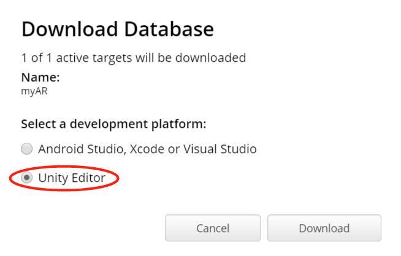
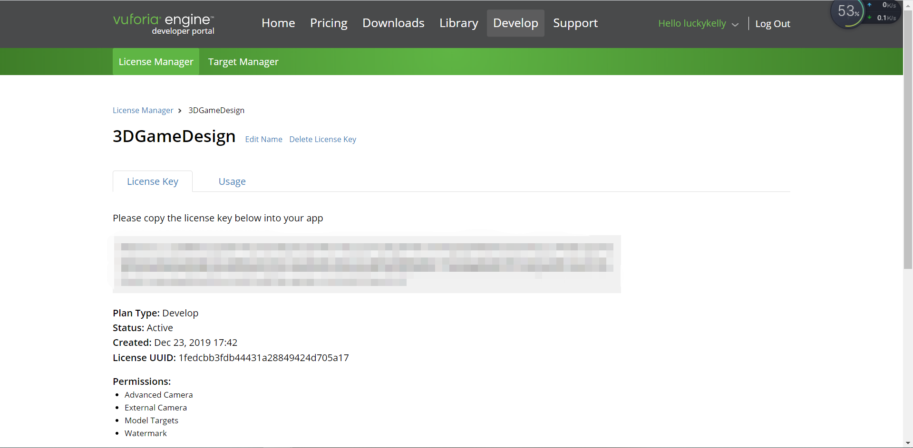

# Homework 11

### 图片识别和建模+虚拟按键小游戏


#### 图片识别和建模

首先，需要选择一张图片作为AR识别的背景图，颜色越鲜艳越好，这样子能够更方便识别出来，我选择的图片是下面这一张


然后需要将图片上传到网络上，这里使用vuforia作为资源，在[官网](https://developer.vuforia.com/)上注册一个账号之后，点击`Develop->Target Manager->Add Database`创建自己的数据库


接着进入数据库，点击`Add Target`上传刚刚选好的图片，注意`Width`就输入图片的宽度就可以了。

然后选中图片，点击右侧的`Download Database`进行下载，注意在弹出来的提示框中选择`Unity Editor`





紧接着回到`License Manager`的界面中，创建自己的`License Key`，这个许可证后面将会使用到。


这时就可以进入`Unity`软件中进行`Vuforia`的安装了。在主界面中选择`File->Build Settings->Player Settings`，在`Inspector`界面中选择`XR Support Installer`下的`Vuforia Augmented Reality`，就会自动下载对应`Unity`版本的`Vuforia`了。注意安装的时候一定要安装在`Unity`的安装目录下，否则会安装失败。 


安装成功之后会发现`XR Settings`下多了一个选项


这时我们往项目中导入刚刚下载的`unitypackage`：在主界面中选择`Assets->Import packages`，选择刚刚下载的包即可。


然后删除默认的`Camera`，在`GameObject`中选择添加`Vuforia Engine`中的`AR Camera`，并在摄像机中添加刚刚的许可证（整个复制粘贴就可以了）


许可证：




下面开始创建`Image Target`。右击选择`Vuforia Engine->Camera Image-> Camera Image Target`。它的`type`改为`predefined`，`Image Target`和`Database`设为自己的图片名和数据库名


可以在`Unity Asset Store`中选择自己喜欢的资源，作为识别显示的模型，然后拖动到`Image Target`下即可，这时运行程序，将电脑摄像头对准图片，即可将模型映像出来了。


#### 虚拟按键

在`Image Target`的`Inspector`界面下的`Image Target Behaviour`中点击`Add Virtual Button`添加一个虚拟按键，并为它设置一个`plane`对象，大小调整到合适即可，同时根据背景颜色调整按键的颜色，使得按键能够清晰的显示出来。


我为这个按键添加了一个简单的事件，就是将模型旋转180度，实现起来并不是很复杂

```c#
public void OnButtonPressed(VirtualButtonBehaviour vb)
{
    if (vb.VirtualButtonName == "VirtualButton")
    {
        ani.gameObject.transform.Rotate(Vector3.up * 180);
    }
    Debug.Log(vb.VirtualButtonName);
    //throw new System.NotImplementedException();
}

public void OnButtonReleased(VirtualButtonBehaviour vb)
{
    ani.gameObject.transform.Rotate(Vector3.up * 180);
}
```


最终的显示效果大致如下：


最后附上

[项目地址](https://github.com/LSunQQ/3D-games/tree/homework11)

[视频演示](https://v.youku.com/v_show/id_XNDQ4MDMxNTYyOA==.html?spm=a2h3j.8428770.3416059.1)